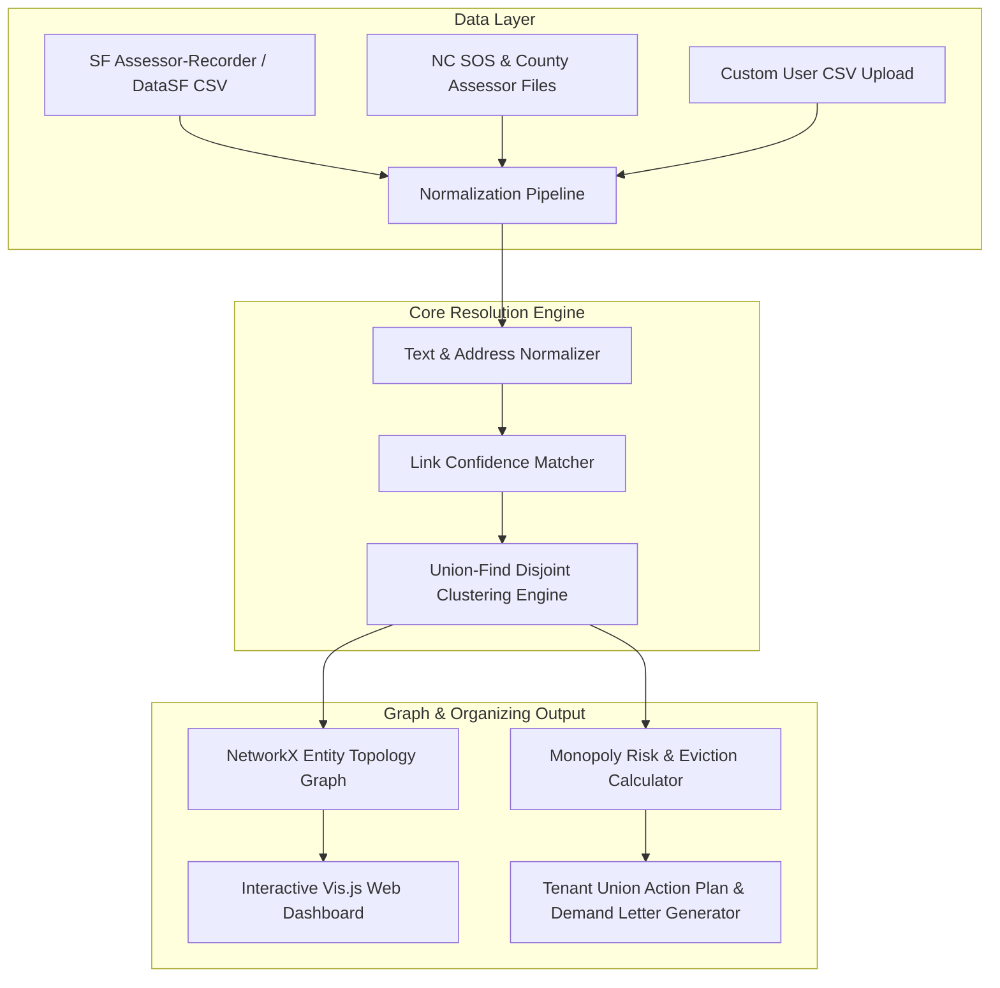

# UnmaskLLC 🚩
> **Automated Corporate Landlord Entity Resolution & Cross-Building Tenant Union Graph Engine**

[](https://www.python.org/downloads/)
[](https://opensource.org/licenses/MIT)
[]()
[]()

**UnmaskLLC** is an open-source civic tech and labor/tenant organizing platform that demystifies corporate real estate ownership networks. Corporate landlords and private equity firms fragment their portfolios behind hundreds of single-asset shell LLCs (e.g. `1230 Market Street LLC`, `1232 Market Street LLC`) to obscure monopoly control, evade public accountability, and prevent tenant organizing.

UnmaskLLC inverts this power dynamic by applying **Automated Disjoint-Set (Union-Find) Entity Resolution**, **Network Graph Analytics**, and **Address Normalization** to raw property deeds, registered agent filings, and tax assessor records. 

With UnmaskLLC, tenants in **San Francisco** or **North Carolina (Raleigh, Durham, Charlotte)** can type in any street address and instantly discover all sister properties in their city or region owned by the same hidden parent entity—generating instant multi-building tenant union organizing packets and collective demand letters.

---

## 🏗 System Architecture



---

## ✨ Key Features

1. **Automated Disjoint-Set Entity Resolution:**
   * Matches entity webs using fuzzy name matching, address normalization (`libpostal` standard), registered agent cross-linking, tax mailing address overlap, and shared corporate officers.
2. **Interactive Topology Network Visualizer:**
   * Renders multi-layer node-edge graphs (Parent Holding Companies $\rightarrow$ Shell LLCs $\rightarrow$ Registered Agents $\rightarrow$ Properties).
3. **Tenant Union Action Plan Generator:**
   * Automatically compiles cross-building organizing packets, sister property directories, unit counts, and pre-filled collective demand letters.
4. **Monopoly & Portfolio Risk Scoring:**
   * Calculates a 0–100 Monopoly Risk Score based on housing unit concentration, 3-year eviction history, and building habitability code violations.
5. **Dual Regional Focus:**
   * Comes pre-loaded with realistic, high-fidelity sample datasets for both **San Francisco** (Tenderloin, Mission, SoMa) and **North Carolina** (Raleigh, Durham, Charlotte).
6. **CLI & Web Dashboard:**
   * Includes both a robust CLI for script pipelines (`unmask-llc run`, `unmask-llc packet`) and a modern FastAPI + Tailwind CSS web dashboard (`unmask-llc serve`).

---

## 🚀 Quickstart & Installation

### 1. Clone & Setup Virtual Environment
```bash
git clone https://github.com/ajejfiejof/unmask-llc.git
cd unmask-llc

python3 -m venv venv
source venv/bin/activate
pip install -e .
```

### 2. Run Test Suite
```bash
pytest -v
```

---

## 💻 CLI Usage

UnmaskLLC provides a full command-line suite:

```bash
# Run entity resolution on dataset and print summary
unmask-llc run

# Export resolution output to JSON
unmask-llc run --format json

# Search for a property address or shell company name
unmask-llc search "Market Street"

# Generate a markdown tenant organizing packet for a target property
unmask-llc packet "1230 Market Street" --output market_st_packet.md

# Launch interactive web dashboard server
unmask-llc serve --port 8000
```

---

## 🌐 Web Dashboard Preview

Launch the web dashboard:
```bash
unmask-llc serve
```
Navigate to `http://localhost:8000` in your web browser:
* **Interactive Network Canvas:** Click and drag nodes to explore corporate shell entity networks.
* **Search & Unmask:** Type any address or LLC name to highlight its parent cluster.
* **Organizing Packet Generator:** Click *"Generate Tenant Organizing Packet"* to view multi-building tactical steps and copy a sample collective demand letter.

---

## 📊 Sample Entity Resolution Output

```text
=== UNMASK-LLC ENTITY RESOLUTION SUMMARY ===
Resolved 7 properties and 9 corporate entities into 3 beneficial ownership clusters.

🏢 [MONOPOLISTIC RISK] Parent Entity: PACIFIC APEX HOLDINGS LLC
   - Shell LLC Count: 4
   - Total Properties: 3 | Total Housing Units: 156
   - Monopoly Score: 100.0/100 | Evictions (3yr): 25
   - Portfolio Addresses:
     * 1230 Market Street, San Francisco, CA (48 units)
     * 550 Mission Bay Blvd, San Francisco, CA (72 units)
     * 885 Eddy Street, San Francisco, CA (36 units)

🏢 [MONOPOLISTIC RISK] Parent Entity: TARHEEL CAPITAL EQUITY PARTNERS LLC
   - Shell LLC Count: 4
   - Total Properties: 3 | Total Housing Units: 197
   - Monopoly Score: 100.0/100 | Evictions (3yr): 20
   - Portfolio Addresses:
     * 400 Fayetteville Street, Raleigh, NC (60 units)
     * 710 Chapel Hill Street, Durham, NC (42 units)
     * 200 S Tryon Street, Charlotte, NC (95 units)
```

---

## 🚩 Political Economy Rationale

Housing is a fundamental human right, not a financial speculative asset. Capitalist real estate firms intentionally obscure their beneficial ownership to isolate tenant bargaining power and avoid legal scrutiny. 

By building **open, worker-and-tenant-controlled counter-intelligence software**, UnmaskLLC helps tenants transition from single-building grievances to **regional multi-property tenant unions** capable of negotiating collective agreements and defending working-class communities.

---

## 📄 License

Distributed under the MIT License. Built for community organizers, tenant unions, and civic tech advocates.
